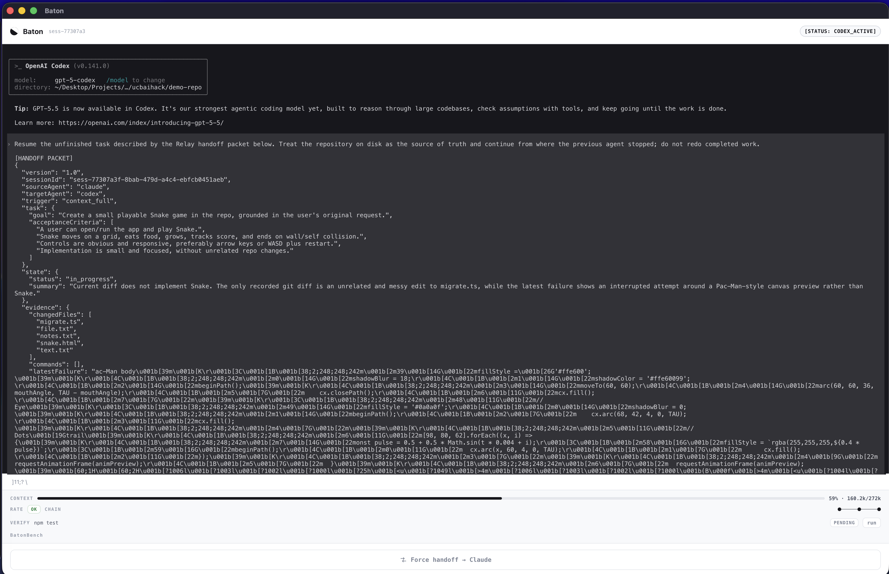

# Baton

[](https://github.com/Unieggy/Baton/actions/workflows/ci.yml)
[](https://opensource.org/licenses/ISC)
[](https://www.typescriptlang.org/)
[](https://nodejs.org/)
[](https://react.dev/)
[](https://vite.dev/)
[](https://www.electronjs.org/)
[](https://redis.io/)


**Baton compiles noisy agent work into the smallest verified state another coding tool needs to continue.**

When an AI coding agent hits a usage limit, crashes, or stalls mid-task, you
normally have to re-explain everything to the next tool. Baton captures the
unfinished work from *factual evidence* (git diff, test exit codes, terminal
output), compiles a small portable **handoff packet**, launches a **different**
agent in the same repository, and verifies whether it actually finished — the
developer never re-explains the task.

Baton is not an editor or a Cursor clone. It runs the **real** Claude Code / Codex
CLIs embedded in a terminal — you talk to the genuine agent, approval prompts and
all — and transfers work *between* them (Claude Code ⇄ Codex CLI) through a
visible, provider-neutral manifest whenever a limit is hit.



The sidebar above is one continuous session: the real agent's terminal (xterm.js
over a PTY), a monochrome status label (`[STATUS: CODEX_ACTIVE]`), the ambient
context / rate / verify telemetry, and a low-profile **Force handoff** control.

---

## Quickstart

There are two commands. **The app** runs the real Claude/Codex CLIs embedded in
a terminal; **dev** runs deterministic fake agents in a browser for UI work.

```bash
npm install

# The app — the genuine claude/codex TUI embedded in the Baton sidebar.
claude                 # complete Claude sign-in once, then exit
codex login            # complete Codex/ChatGPT sign-in once
npm run desktop        # Electron window, docked to a screen edge
```

Type your task in the embedded terminal and talk to the agent exactly as you
normally would — approval prompts and all. Baton watches the context window and
rate limits in the background and, when a limit hits, compiles a handoff packet
and **relays the work to the other agent inside the same session**. A low-profile
**Force handoff** control does it on demand.

The agents run in a real pseudo-terminal (`node-pty`); the UI mirrors it with
xterm.js. `npm run desktop` starts the server, UI, and Electron shell together;
closing Electron stops the stack. The Workspace field gets a native **Browse…**
folder picker. Dock side / float: `RELAY_DOCK=left|right|float npm run desktop`.

### Dev mode (no auth, fake agents)

For UI iteration without the provider CLIs — runs the full handoff loop with
deterministic fakes in a browser:

```bash
npm run dev   # prints a dashboard URL; open it and click Start Baton
```

You can also run the app with fakes (`RELAY_FAKE_AGENTS=1 npm run desktop`) or
open the sidebar in any browser at `http://127.0.0.1:4173/?rail=1`.

## The dev-mode flow (`npm run dev`, fake agents)

1. An agent (Claude) starts fixing a real bug in `demo-repo/` — the `users.age`
   migration runs `ALTER TABLE` unconditionally, so the focused test fails.
2. The agent hits a usage limit with the test still red.
3. Baton freezes the workspace, distills a validated handoff packet, and launches
   the other agent (Codex) in the same repo from that packet alone.
4. Codex finishes the task; **Verify** runs the real verification command,
   showing the exit code and verdict.

The user never re-explains the task during the transfer. In the real app
(`npm run desktop`) the same loop runs against the live, authenticated CLIs.

## Architecture

```text
┌─────────────────────────────────────────────────────────────┐
│  React / Vite sidebar (ui/) — Electron or browser           │
│  xterm.js terminal + Baton telemetry                         │
│     ▲ agent output (events)      │ keystrokes / resize       │
└─────┼────────────────────────────┼──────────────────────────┘
      │ WS /ws/sessions/:id (bidirectional) + HTTP /api
┌─────┴────────────────────────────▼──────────────────────────┐
│  Node + TypeScript server (apps/server/src/)                 │
│  ┌────────────┐ ┌───────────┐ ┌────────────┐ ┌────────────┐ │
│  │ session    │ │ pty-runner │ │ orchestr.  │ │ broadcaster│ │
│  │ manager    │ │ (node-pty) │ │ + handoff  │ │ (WS, I/O)  │ │
│  └────────────┘ └─────┬──────┘ └─────┬──────┘ └────────────┘ │
│  ┌──────────────────┐ │             │  ┌──────────────────┐  │
│  │ interactive       │◀┘             └─▶│ event store      │  │
│  │ adapters claude/cdx│                 │ Redis | in-memory│  │
│  └─────────┬──────────┘                 └──────────────────┘  │
└────────────┼─────────────────────────────────────────────────┘
             ▼
   real `claude` / `codex` TUI  ⟶  Local Git repository (workspace)
```

The real agents run inside a pseudo-terminal (`node-pty`); the sidebar mirrors
them with xterm.js over a single bidirectional WebSocket. Baton observes the
output stream for limits and routes the handoff — it never sits between you and
the agent. Evidence flows from the repo and command exit codes — **the repository
and executable evidence outrank agent summaries.** (`npm run dev` swaps the
interactive adapters for deterministic fakes; no PTY or auth required.)

The local control server binds to loopback only (`127.0.0.1`) and accepts
browser/WebSocket traffic from the configured dashboard origin.

## Repository map

```text
packages/shared/    Runtime-validated contracts (RelayEvent, HandoffPacket, …)
apps/server/src/    HTTP, sessions, WebSockets, process runner, adapters, store
ui/src/             Terminal companion dashboard + live event projection
demo-repo/          Deterministic migration bug — the handoff target
tests/              Engine + cross-layer contract tests
```

Shared schemas are the dependency boundary: every layer may import
`packages/shared`, but contracts never import an application. Adapters emit
`RelayEvent`s through a `RelayEventSink`; they don't know whether events are
broadcast, persisted, or both.

## Verification

```bash
npm test          # engine + server suites
npm run typecheck
npm run ui:build
```

Redis is optional — set `REDIS_URL` for durable, refresh-surviving timelines;
without it, an in-memory store with the same interface is used.

## Built with

TypeScript · Node.js · React · Vite · node-pty · xterm.js · Electron · Redis ·
WebSocket · Zod · Claude · Codex

## What's next

- Session persistence across server restarts
- Parse each CLI's own context/usage readout (the meter is currently estimated)
- BatonBench baseline runs (the Baton side is measured; no-Baton is still empty)
- Signed, single-binary Electron packaging (bundled `node-pty` via electron-rebuild)
